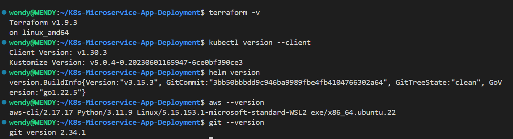

# Kubernetes Microservice App Deployment

## Overview

A microservices-based architecture application is deployed on Kubernetes and there’s a need to create a clear IaaC (Infrastructure as Code) deployment to be able to deploy the services in a fast manner. 

All deliverables need to be deployed using an Infrastructure as Code approach.

●  In your solution please emphasize readability and maintainability (make yor application deployment clear)

●  We expect a clear way to recreate your setup and will evaluate the project decisions based on:

Deploy pipeline

Metrics (Alertmanager)

Monitoring (Grafana)

Logging (Prometheus)

●  Use Prometheus as a monitoring tool

●  Use Ansible or Terraform as the configuration management tool.

●  You can use an IaaS provider of your choice.

●  The application should run on Kubernetes


● Setup for provisioning for the sockshop app - https://github.com/microservices-demo/microservices-demo/tree/master

## Prerequisites

● Terraform 

● kubectl 

● Helm 

● AWS CLI (configured with appropriate access)

● Git



## Workflow Overview
● Deploy EKS Cluster with Terraform

● Deploy Microservice Application

● Deploy Let's Encrypt for SSL/TLS Certificates

● Deploy Prometheus for Monitoring

● Deploy NGINX Ingress Controller

● Write and Implement CI/CD Pipelines

### Step 1 - Deploy EKS Cluster
```
cd infrastructure
git clone https://github.com/hashicorp/learn-terraform-provision-eks-cluster

terraform init
```


* Once terraform is initialized, run
```
terraform plan
terraform apply -auto-approve
```


### Step 2 - Deploy the Microservice App 
`cd deployments`

* Configure kubectl

`aws eks --region <region-name> update-kubeconfig --name <cluster-name>`


* Apply the sock-shop.yaml file
`kubectl apply -f sock-shop.yaml`

